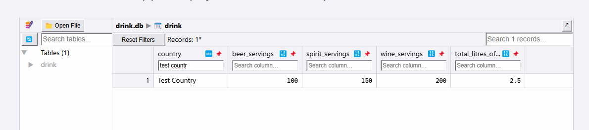

# Allen_Wang_Individualproj_2

[](https://github.com/nogibjj/Allen_Wang_Individualproj_2/actions/workflows/CICD.yml)

## Overview

This project demonstrates a Rust CLI application that performs CRUD operations (Create, Read, Update, Delete) on a SQLite database. The application is packaged as a Rust binary, with CI/CD configured to test, build, and lint code on each commit. An optimized Rust binary is generated as a GitLab Actions artifact for download.

## Project Structure

Here's an updated `README.md` tailored to the project requirements:

## Project Structure

- **src/**: Contains the Rust source code.
- **drink.db**: The SQLite database used for CRUD operations.
- **tests/**: Integration tests for CRUD operations.
- **Makefile**: Commands for setup, testing, and running the application.
  - `make test`: Runs tests.
  - `make release`: Builds an optimized binary.
- **.github/workflows/ci.yml**: GitHub Actions workflow for CI/CD.
- **README.md**: Project description, setup, and instructions.


## CRUD Operations

### Using the Rust CLI:
1. **Create**: Add a new record.
    ```bash
    make create USB 10 20 30 10.7
    ```
2. **Read**: Retrieve all records.
    ```bash
    make read
    ```
3. **Update**: Modify an existing record.
    ```bash
    make update USB 15
    ```
4. **Delete**: Remove a record.
    ```bash
    make delete USB
    ```
5. **Transform**: Load CSV data into the database.
    ```bash
    make transform data.db https://example.com/data.csv
    ```
6. **General**: Execute a custom SQL query.
    ```bash
    make general "UPDATE drink SET beer_servings = 100 WHERE country = 'USB';"
    ```


## Setup

1. **Clone the repository**:

    ```bash
    git clone https://github.com/nogibjj/Allen_Wang_Individualproj_2.git
    cd Allen_Wang_Individualproj_2
    ```

2. **Build**:
    ```bash
    make build
    ```

3. **Format code**:

    ```bash
    make format
    ```

4. **Lint code**:

    ```bash
    make lint
    ```

5. **Test code**:

    ```bash
    make test
    ```
## CI/CD Pipeline

The CI/CD pipeline automatically:
- Builds and lints the Rust code.
- Runs unit tests to validate functionality.
- Generates an optimized binary as a downloadable artifact.

## Demonstration of Database Changes

The following sample operations were conducted on the `drink.db` database during CICD:
1. **Deleted** record for the country *Togo**.
   
2. **Updated** record for **USA**: `beer_servings = 10`.
   
3. **Created** new records for countries **Test Country**.
   

## LLM Usage

I used an LLM to assist with structuring Rust code, especially in areas like module setup, error handling, and efficient CLI input handling. This ensured best practices and enhanced readability in Rust syntax.

## Video Demo

Watch the [project demo on YouTube](#).